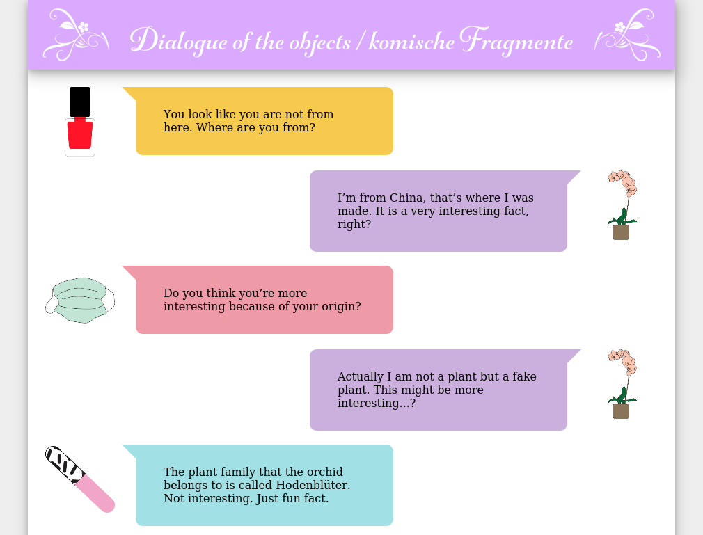

# Dialogue of the Objects/Komische Fragmente

# Application

A web page that looks like a chat application. Using responsive design to fit mobile and desktop view.

## Features 
- url selectable current object (on the right)
- yaml based chat editor

## Installation
- copy the code to a PHP server
- set the admin pass in the admin.php

# Authors
Artists: Jinran Ha and Johanna Käthe Michel

Technical consulting and programming: [Matej Lazar](https://github.com/matejonnet/); co-produced by the [City of Women](http://www.cityofwomen.org), Goethe-Institut Ljubljana, District Berlin.

# Background

In the frame of the exhibition Corneous stories presented at 26th International festival of contemporary arts City of Women which was done in the framework of European project BE PART, supported by the Creative Europe Programme.

Researched for and first produced within N\*A\*I\*L\*S hacks\*facts\*fictions, a project that explored the nail salon as a site of critical, queer and transcultural practices, as well as intersectional care politics, both works by Ha and Michel find a new material representation in the Corneous Stories exhibition.

In the Dialogue of the Objects/Komische Fragmente, artists of different backgrounds disconnect from their physical body, which is always related to individual privileges and violence because of the ways in which identity categories are constructed. Instead, industrially produced objects used in nail studios chat with each other and “innocently” touch upon matters of racism, sexism, identities, capitalism, etc. The talking objects are referring to Sergei Tretiakov’s Biography of the Object (1929), in which the Soviet writer proposed to research social conditions through objects rather than the people who produce them.
